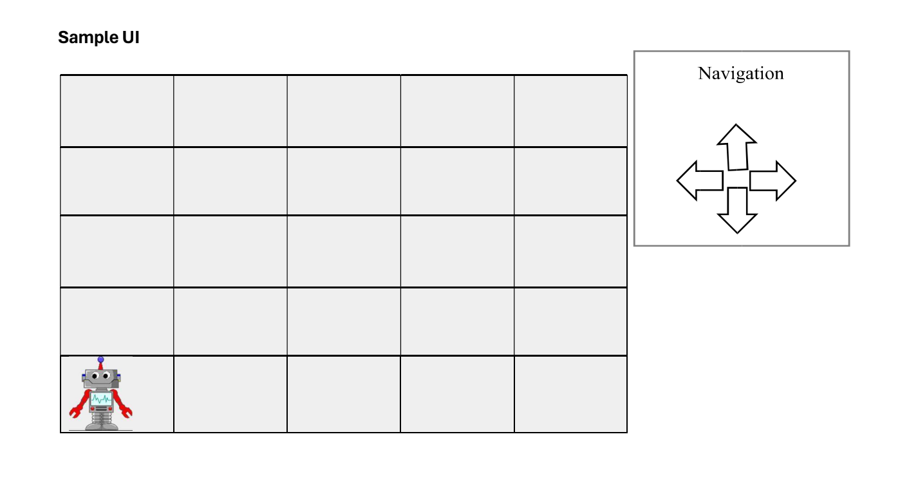

# React + Vite

This template provides a minimal setup to get React working in Vite with HMR and some ESLint rules.

Currently, two official plugins are available:

-   [@vitejs/plugin-react](https://github.com/vitejs/vite-plugin-react/blob/main/packages/plugin-react/README.md) uses [Babel](https://babeljs.io/) for Fast Refresh
-   [@vitejs/plugin-react-swc](https://github.com/vitejs/vite-plugin-react-swc) uses [SWC](https://swc.rs/) for Fast Refresh

Coding Challenge – React JS

This coding challenge is to simulate movement of a simple robot. Write a program using ReactJS to
simulate robot’s movements.
Basic requirement
 The robot is placed on a square table of dimensions 5 units x 5 units.
 Initially the robot is placed at the cell 1,1
 Robot is free to move around the table surface, as there are no obstructions, however it should not
fall from the table edge.
 Robot travels can move North, East, South or West by one unit at a time. There should be
navigation buttons to make this possible.
 Clicking/tapping on a cell will teleport the robot to that cell. Robot will be able to travel in any
direction using this method
Optional
 Teleporting should delay based on the distance the robot has to travel.

Additional info
 Simple UI is provided above; feel free to embellish UI or functionality.
 Consider patterns, best practices, testability etc. when implementing your solution.
 Write a unit test at least for the most critical component.
 Submit your solution as standalone project, online project hosted in codesandbox.io etc. or a
GitHub repo.
